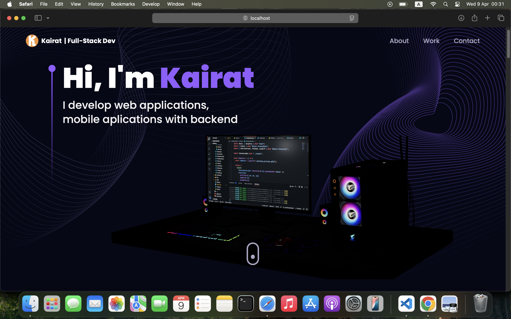

# 🚀 Dimensional Portfolio

A visually engaging 3D portfolio built with **React**, **Vite**, **Three.js**, and **Tailwind CSS** — designed to showcase my skills as a Full-Stack Developer.

 <!-- Optional: replace or remove -->

---

## ✨ Features

- ⚡️ Lightning-fast performance with **Vite**
- 🎨 Styled using **Tailwind CSS v3**
- 🎥 Animated interactions with **Framer Motion**
- 🧠 3D scenes powered by **@react-three/fiber** and **drei**
- 💌 Contact form integrated via **EmailJS**
- 💻 Responsive, mobile-friendly layout
- 🌟 Custom canvas effects with **Three.js** (e.g., `StarsCanvas`)
- 📜 Timeline experience using **react-vertical-timeline-component**
- 💡 Tilt effects via **react-parallax-tilt**

---

## 🛠️ Tech Stack

- **React 19**
- **Vite 6**
- **Tailwind CSS 3.3.5**
- **Framer Motion**
- **Three.js** + **@react-three/fiber** + **maath**
- **EmailJS**
- **React Router 7**
- **ESM (ECMAScript Modules)** based setup

---

## 📦 Setup & Installation

```bash
# Clone the repo
git clone https://github.com/kairatbek-d/dimensional_portfolio
cd dimensional_portfolio

# Install dependencies
npm install

# Start the dev server
npm run dev